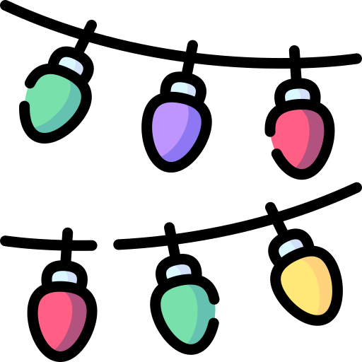

## Hello , I'm Sandra Golden 

I'm a software engineer  building stuff at Salesforce Commerce Cloud &nbsp;...

but I also like:<br/><br/>
swimming <br/>
soccer  (former collegiate player at )<br/>
bird watching <br/>
lattes <br/>
incandescent light <br/>
fish tacos <br/>
music <br/>
movies <br/>
laughing <br/>
silver <br/>
hiking <br/>
the number 
<br/><br/>
 <a href="https://www.linkedin.com/in/sandragolden/">in/sandragolden</a>
<br/><br/>
<!--START_SECTION:waka-->


**🐱 My GitHub Data** 

> 📦 8.3 MB Used in GitHub's Storage 
 > 
> 🏆 475 Contributions in the Year 2025
 > 
> 🚫 Not Opted to Hire
 > 
> 📜 47 Public Repositories 
 > 
> 🔑 221 Private Repositories 
 > 
**I'm an Early 🐤** 

```text
🌞 Morning                936 commits         ██████░░░░░░░░░░░░░░░░░░░   22.88 % 
🌆 Daytime                2303 commits        ██████████████░░░░░░░░░░░   56.29 % 
🌃 Evening                724 commits         ████░░░░░░░░░░░░░░░░░░░░░   17.70 % 
🌙 Night                  128 commits         █░░░░░░░░░░░░░░░░░░░░░░░░   03.13 % 
```
📅 **I'm Most Productive on Wednesday** 

```text
Monday                   844 commits         █████░░░░░░░░░░░░░░░░░░░░   20.63 % 
Tuesday                  684 commits         ████░░░░░░░░░░░░░░░░░░░░░   16.72 % 
Wednesday                1002 commits        ██████░░░░░░░░░░░░░░░░░░░   24.49 % 
Thursday                 673 commits         ████░░░░░░░░░░░░░░░░░░░░░   16.45 % 
Friday                   563 commits         ███░░░░░░░░░░░░░░░░░░░░░░   13.76 % 
Saturday                 226 commits         █░░░░░░░░░░░░░░░░░░░░░░░░   05.52 % 
Sunday                   99 commits          █░░░░░░░░░░░░░░░░░░░░░░░░   02.42 % 
```


📊 **This Week I Spent My Time On** 

```text
🕑︎ Time Zone: America/Los_Angeles

💬 Programming Languages: 
JavaScript               16 hrs 35 mins      ██████████░░░░░░░░░░░░░░░   40.64 % 
Markdown                 6 hrs 24 mins       ████░░░░░░░░░░░░░░░░░░░░░   15.68 % 
Other                    4 hrs 53 mins       ███░░░░░░░░░░░░░░░░░░░░░░   11.99 % 
Bash                     2 hrs 40 mins       ██░░░░░░░░░░░░░░░░░░░░░░░   06.54 % 
JSON                     2 hrs 20 mins       █░░░░░░░░░░░░░░░░░░░░░░░░   05.75 % 

🔥 Editors: 
WebStorm                 23 hrs 8 mins       ██████████████░░░░░░░░░░░   56.68 % 
Cursor                   16 hrs 42 mins      ██████████░░░░░░░░░░░░░░░   40.92 % 
IntelliJ IDEA            52 mins             █░░░░░░░░░░░░░░░░░░░░░░░░   02.14 % 
PyCharm                  6 mins              ░░░░░░░░░░░░░░░░░░░░░░░░░   00.26 % 

💻 Operating System: 
Mac                      40 hrs 50 mins      █████████████████████████   100.00 % 
```

**I Mostly Code in JavaScript** 

```text
JavaScript               144 repos           ████████████████░░░░░░░░░   62.88 % 
Apex                     28 repos            ███░░░░░░░░░░░░░░░░░░░░░░   12.23 % 
TypeScript               8 repos             █░░░░░░░░░░░░░░░░░░░░░░░░   03.49 % 
Python                   7 repos             █░░░░░░░░░░░░░░░░░░░░░░░░   03.06 % 
Vue                      2 repos             ░░░░░░░░░░░░░░░░░░░░░░░░░   00.87 % 
```


 Last Updated on 12/12/2025 08:11:27 UTC
<!--END_SECTION:waka-->
