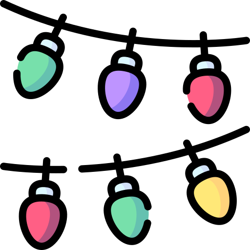

## Hello , I'm Sandra Golden 

I'm a software engineer  building stuff at Salesforce Commerce Cloud &nbsp;...

but I also like:<br/><br/>
swimming <br/>
soccer  (former collegiate player at )<br/>
bird watching <br/>
lattes <br/>
incandescent light <br/>
fish tacos <br/>
music <br/>
movies <br/>
laughing <br/>
silver <br/>
hiking <br/>
the number 
<br/><br/>
 <a href="https://www.linkedin.com/in/sandragolden/">in/sandragolden</a>
<br/><br/>
<!--START_SECTION:waka-->


**🐱 My GitHub Data** 

> 📦 8.3 MB Used in GitHub's Storage 
 > 
> 🏆 49 Contributions in the Year 2026
 > 
> 🚫 Not Opted to Hire
 > 
> 📜 45 Public Repositories 
 > 
> 🔑 224 Private Repositories 
 > 
**I'm an Early 🐤** 

```text
🌞 Morning                1040 commits        ██████░░░░░░░░░░░░░░░░░░░   22.91 % 
🌆 Daytime                2516 commits        ██████████████░░░░░░░░░░░   55.43 % 
🌃 Evening                816 commits         ████░░░░░░░░░░░░░░░░░░░░░   17.98 % 
🌙 Night                  167 commits         █░░░░░░░░░░░░░░░░░░░░░░░░   03.68 % 
```
📅 **I'm Most Productive on Wednesday** 

```text
Monday                   976 commits         █████░░░░░░░░░░░░░░░░░░░░   21.50 % 
Tuesday                  765 commits         ████░░░░░░░░░░░░░░░░░░░░░   16.85 % 
Wednesday                1089 commits        ██████░░░░░░░░░░░░░░░░░░░   23.99 % 
Thursday                 738 commits         ████░░░░░░░░░░░░░░░░░░░░░   16.26 % 
Friday                   634 commits         ███░░░░░░░░░░░░░░░░░░░░░░   13.97 % 
Saturday                 230 commits         █░░░░░░░░░░░░░░░░░░░░░░░░   05.07 % 
Sunday                   107 commits         █░░░░░░░░░░░░░░░░░░░░░░░░   02.36 % 
```


📊 **This Week I Spent My Time On** 

```text
🕑︎ Time Zone: America/Los_Angeles

💬 Programming Languages: 
TypeScript               4 hrs 16 mins       ███████████████████░░░░░░   74.32 % 
Other                    26 mins             ██░░░░░░░░░░░░░░░░░░░░░░░   07.70 % 
Markdown                 23 mins             ██░░░░░░░░░░░░░░░░░░░░░░░   06.85 % 
Bash                     16 mins             █░░░░░░░░░░░░░░░░░░░░░░░░   04.88 % 
.env file                9 mins              █░░░░░░░░░░░░░░░░░░░░░░░░   02.64 % 

🔥 Editors: 
WebStorm                 4 hrs 9 mins        ██████████████████░░░░░░░   72.12 % 
VS Code                  1 hr 36 mins        ███████░░░░░░░░░░░░░░░░░░   27.88 % 

💻 Operating System: 
Mac                      5 hrs 45 mins       █████████████████████████   100.00 % 
```

**I Mostly Code in JavaScript** 

```text
JavaScript               144 repos           ████████████████░░░░░░░░░   62.07 % 
Apex                     28 repos            ███░░░░░░░░░░░░░░░░░░░░░░   12.07 % 
TypeScript               10 repos            █░░░░░░░░░░░░░░░░░░░░░░░░   04.31 % 
Shell                    4 repos             ░░░░░░░░░░░░░░░░░░░░░░░░░   01.72 % 
Vue                      2 repos             ░░░░░░░░░░░░░░░░░░░░░░░░░   00.86 % 
```


 Last Updated on 03/20/2026 08:17:54 UTC
<!--END_SECTION:waka-->
