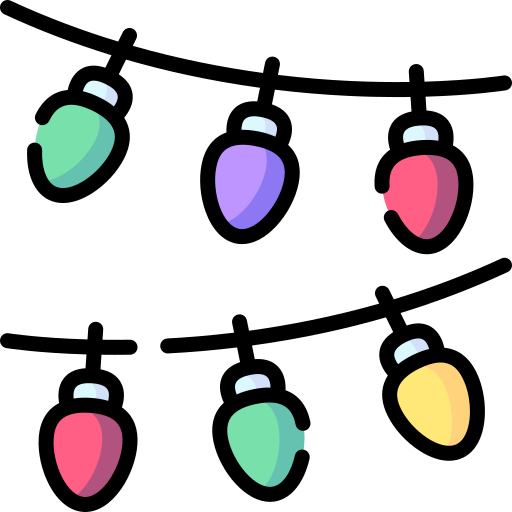

## Hello , I'm Sandra Golden 

I'm a software engineer  building stuff at Salesforce Commerce Cloud &nbsp;...

but I also like:<br/><br/>
swimming <br/>
soccer  (former collegiate player at )<br/>
bird watching <br/>
lattes <br/>
incandescent light <br/>
fish tacos <br/>
music <br/>
movies <br/>
laughing <br/>
silver <br/>
hiking <br/>
the number 
<br/><br/>
 <a href="https://www.linkedin.com/in/sandragolden/">in/sandragolden</a>
<br/><br/>
<!--START_SECTION:waka-->


**🐱 My GitHub Data** 

> 📦 8.4 MB Used in GitHub's Storage 
 > 
> 🏆 161 Contributions in the Year 2026
 > 
> 🚫 Not Opted to Hire
 > 
> 📜 46 Public Repositories 
 > 
> 🔑 226 Private Repositories 
 > 
**I'm an Early 🐤** 

```text
🌞 Morning                1067 commits        ██████░░░░░░░░░░░░░░░░░░░   23.01 % 
🌆 Daytime                2554 commits        ██████████████░░░░░░░░░░░   55.08 % 
🌃 Evening                842 commits         █████░░░░░░░░░░░░░░░░░░░░   18.16 % 
🌙 Night                  174 commits         █░░░░░░░░░░░░░░░░░░░░░░░░   03.75 % 
```
📅 **I'm Most Productive on Wednesday** 

```text
Monday                   998 commits         █████░░░░░░░░░░░░░░░░░░░░   21.52 % 
Tuesday                  788 commits         ████░░░░░░░░░░░░░░░░░░░░░   16.99 % 
Wednesday                1104 commits        ██████░░░░░░░░░░░░░░░░░░░   23.81 % 
Thursday                 757 commits         ████░░░░░░░░░░░░░░░░░░░░░   16.33 % 
Friday                   652 commits         ████░░░░░░░░░░░░░░░░░░░░░   14.06 % 
Saturday                 231 commits         █░░░░░░░░░░░░░░░░░░░░░░░░   04.98 % 
Sunday                   107 commits         █░░░░░░░░░░░░░░░░░░░░░░░░   02.31 % 
```


📊 **This Week I Spent My Time On** 

```text
🕑︎ Time Zone: America/Los_Angeles

💬 Programming Languages: 
Markdown                 8 hrs 11 mins       ███████░░░░░░░░░░░░░░░░░░   26.05 % 
TypeScript               5 hrs 59 mins       █████░░░░░░░░░░░░░░░░░░░░   19.02 % 
Other                    3 hrs 45 mins       ███░░░░░░░░░░░░░░░░░░░░░░   11.95 % 
JavaScript               1 hr 58 mins        ██░░░░░░░░░░░░░░░░░░░░░░░   06.28 % 
Bash                     1 hr 52 mins        █░░░░░░░░░░░░░░░░░░░░░░░░   05.97 % 

🔥 Editors: 
Claude Code              14 hrs 10 mins      ███████████░░░░░░░░░░░░░░   45.05 % 
WebStorm                 9 hrs 39 mins       ████████░░░░░░░░░░░░░░░░░   30.70 % 
VS Code                  4 hrs 54 mins       ████░░░░░░░░░░░░░░░░░░░░░   15.62 % 
IntelliJ IDEA            1 hr 32 mins        █░░░░░░░░░░░░░░░░░░░░░░░░   04.89 % 
Rider                    51 mins             █░░░░░░░░░░░░░░░░░░░░░░░░   02.72 % 

💻 Operating System: 
Mac                      31 hrs 28 mins      █████████████████████████   100.00 % 
```

**I Mostly Code in JavaScript** 

```text
JavaScript               144 repos           ███████████████░░░░░░░░░░   61.02 % 
Apex                     29 repos            ███░░░░░░░░░░░░░░░░░░░░░░   12.29 % 
TypeScript               12 repos            █░░░░░░░░░░░░░░░░░░░░░░░░   05.08 % 
Python                   8 repos             █░░░░░░░░░░░░░░░░░░░░░░░░   03.39 % 
Shell                    4 repos             ░░░░░░░░░░░░░░░░░░░░░░░░░   01.69 % 
```


 Last Updated on 08/08/2026 08:34:56 UTC
<!--END_SECTION:waka-->
