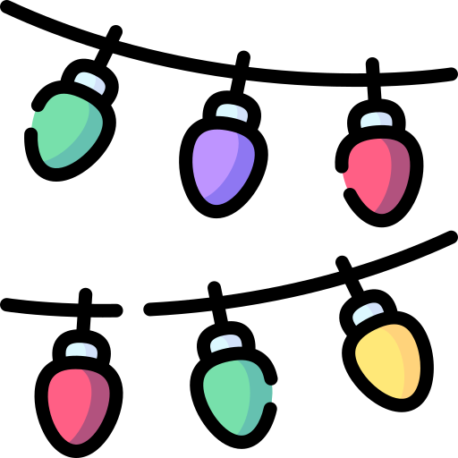

## Hello , I'm Sandra Golden 

I'm a software engineer  building stuff at Salesforce Commerce Cloud &nbsp;...

but I also like:<br/><br/>
swimming <br/>
soccer  (former collegiate player at )<br/>
bird watching <br/>
lattes <br/>
incandescent light <br/>
fish tacos <br/>
music <br/>
movies <br/>
laughing <br/>
silver <br/>
hiking <br/>
the number 
<br/><br/>
 <a href="https://www.linkedin.com/in/sandragolden/">in/sandragolden</a>
<br/><br/>
<!--START_SECTION:waka-->


**🐱 My GitHub Data** 

> 📦 8.4 MB Used in GitHub's Storage 
 > 
> 🏆 191 Contributions in the Year 2026
 > 
> 🚫 Not Opted to Hire
 > 
> 📜 46 Public Repositories 
 > 
> 🔑 227 Private Repositories 
 > 
**I'm an Early 🐤** 

```text
🌞 Morning                1068 commits        ██████░░░░░░░░░░░░░░░░░░░   22.93 % 
🌆 Daytime                2562 commits        ██████████████░░░░░░░░░░░   55.00 % 
🌃 Evening                851 commits         █████░░░░░░░░░░░░░░░░░░░░   18.27 % 
🌙 Night                  177 commits         █░░░░░░░░░░░░░░░░░░░░░░░░   03.80 % 
```
📅 **I'm Most Productive on Wednesday** 

```text
Monday                   997 commits         █████░░░░░░░░░░░░░░░░░░░░   21.40 % 
Tuesday                  799 commits         ████░░░░░░░░░░░░░░░░░░░░░   17.15 % 
Wednesday                1103 commits        ██████░░░░░░░░░░░░░░░░░░░   23.68 % 
Thursday                 763 commits         ████░░░░░░░░░░░░░░░░░░░░░   16.38 % 
Friday                   656 commits         ████░░░░░░░░░░░░░░░░░░░░░   14.08 % 
Saturday                 233 commits         █░░░░░░░░░░░░░░░░░░░░░░░░   05.00 % 
Sunday                   107 commits         █░░░░░░░░░░░░░░░░░░░░░░░░   02.30 % 
```


📊 **This Week I Spent My Time On** 

```text
🕑︎ Time Zone: America/Los_Angeles

💬 Programming Languages: 
JavaScript               4 hrs 45 mins       ██████░░░░░░░░░░░░░░░░░░░   23.46 % 
Markdown                 3 hrs 18 mins       ████░░░░░░░░░░░░░░░░░░░░░   16.28 % 
TypeScript               3 hrs 10 mins       ████░░░░░░░░░░░░░░░░░░░░░   15.60 % 
XML                      3 hrs 9 mins        ████░░░░░░░░░░░░░░░░░░░░░   15.55 % 
JSON                     1 hr 16 mins        ██░░░░░░░░░░░░░░░░░░░░░░░   06.26 % 

🔥 Editors: 
WebStorm                 8 hrs 34 mins       ███████████░░░░░░░░░░░░░░   42.21 % 
Claude Code              8 hrs 3 mins        ██████████░░░░░░░░░░░░░░░   39.67 % 
VS Code                  3 hrs 26 mins       ████░░░░░░░░░░░░░░░░░░░░░   16.97 % 
PyCharm                  13 mins             ░░░░░░░░░░░░░░░░░░░░░░░░░   01.14 % 

💻 Operating System: 
Mac                      20 hrs 18 mins      █████████████████████████   100.00 % 
```

**I Mostly Code in JavaScript** 

```text
JavaScript               143 repos           ███████████████░░░░░░░░░░   60.85 % 
Apex                     29 repos            ███░░░░░░░░░░░░░░░░░░░░░░   12.34 % 
TypeScript               12 repos            █░░░░░░░░░░░░░░░░░░░░░░░░   05.11 % 
Python                   8 repos             █░░░░░░░░░░░░░░░░░░░░░░░░   03.40 % 
Shell                    4 repos             ░░░░░░░░░░░░░░░░░░░░░░░░░   01.70 % 
```


 Last Updated on 10/10/2026 14:13:15 UTC
<!--END_SECTION:waka-->
